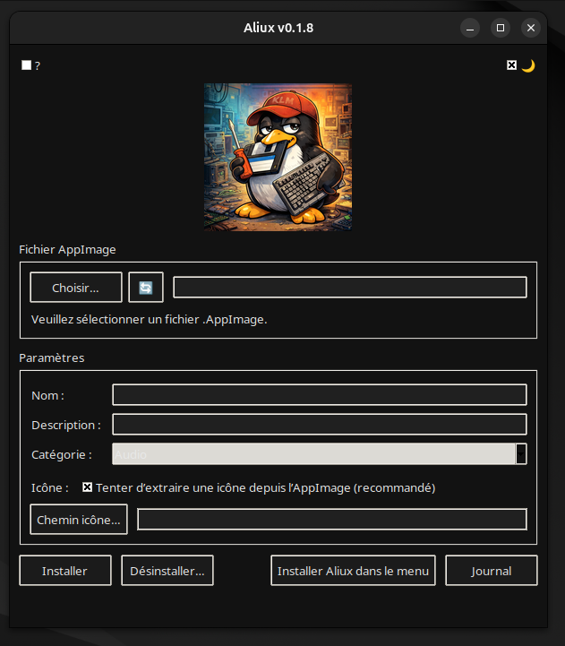

# Aliux

**Aliux** est un outil graphique léger pour **installer, organiser et lancer des AppImages** sous Linux, sans dépendre d’un gestionnaire de paquets système.

Il permet de centraliser vos AppImages dans un emplacement propre, de créer automatiquement les entrées de menu, et de garder un environnement utilisateur cohérent.

---

## Aperçu



---

## Fonctionnalités

- Installation locale d’AppImages (sans `sudo`)(à part pour lui même)
- Organisation des applications dans un répertoire dédié
- Création automatique des fichiers `.desktop`
- Icônes gérées proprement
- Interface graphique simple (Python / Tkinter)
- Compatible avec les environnements Linux standards (GNOME, KDE, XFCE…)

---

## Téléchargement (Linux)

Les binaires sont fournis sous forme **AppImage**.

👉 **Télécharger la dernière version :**  
https://github.com/mrklm/aliux/releases/latest

Fichier attendu :
```text

LIRE_AVANT_DEMARRAGE.txt

Aliux-x.y.z-linux-x86_64.AppImage
Aliux-x.y.z-linux-x86_64.AppImage.SHA256
Aliux-x.y.z-linux-x86_64.tar.gz
Aliux-x.y.z-linux-x86_64.tar.gz.SHA256


